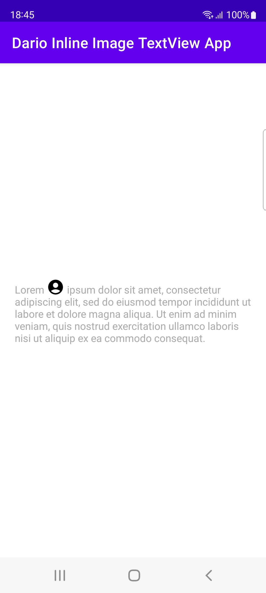

# DarioInlineImageTextView
Android TextView with inline image.



## Usage
```xml
<com.labstyle.darioinlineimagetextview.DarioInlineImageTextView
    android:id="@+id/text0"
    android:layout_width="wrap_content"
    android:layout_height="wrap_content"
    android:text="hello world"
    app:inlineImgResourceId="@drawable/ic_baseline_account_circle_24"
    app:inlineImgIndexInText="6"
    app:inlineImageVerticalAlign="bottom" />
```

## Set image through code
```kotlin
inlineImgTextView.setInlineImage(
    imgResId = R.drawable.ic_baseline_account_circle_24,
    atIndex = 1)
```

## Handle click on image
```kotlin
inlineImgTextView.setImageClickHandler {
    Log.d("dbg", "click")
}
```

## Other options
```kotlin
inlineImgTextView.setInlineImage(
    imgResId = R.drawable.ic_baseline_account_circle_24,
    imgAlign = DynamicDrawableSpan.ALIGN_BASELINE,
    text = "hello world",
    atIndex = 5,
    clickHandler = {
        Log.d("dbg", "click")
    }
)
```
